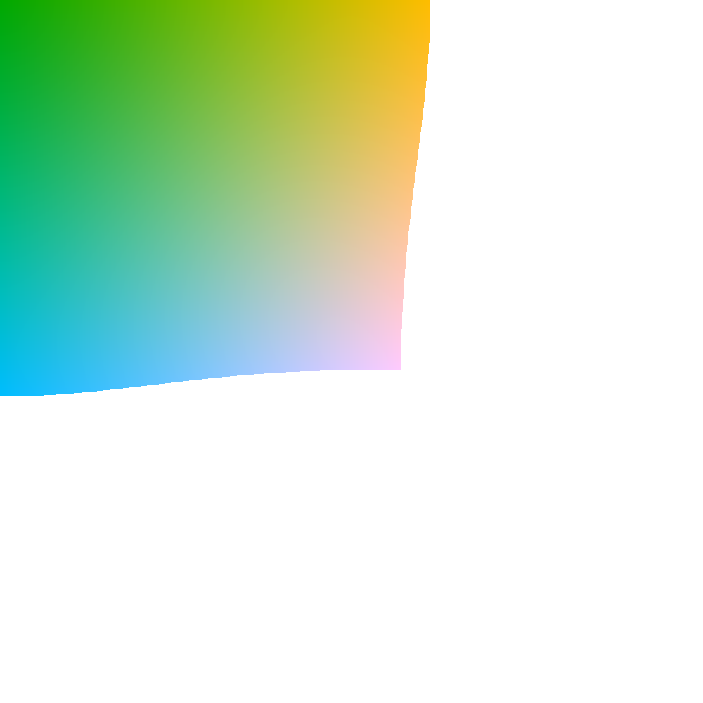

# uRGB: colorspace based off of RGB where the length of the color is its light/brightness

Refrence code is in `urgb.h`.

## Demos of colorspace

Slice of the uRGB gamut, with g=0.5 and r=x and b=y. Transparent regions indicate areas where the uRGB color cannot be displayed in normal RGB.

Gradient with smooth transistion between blue and yellow, calculated in uRGB.

> A thing I noticed: it seems as if in the center of this gradient it slightly hue-shifts to green, which actually makes sense here since blue+yellow = green...

Gradient with smooth transistion between white and blue, calculated in uRGB.

Gradient with smooth transistion between black and white, calculated in uRGB.
